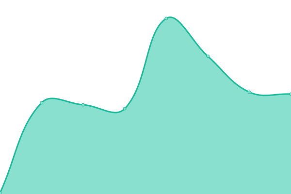

# [📈 Live Status](https://biocom.github.io/cowmonitor): <!--live status--> **🟩 All systems operational**

This repository contains the open-source uptime monitor and status page for [Michel](https://biocom.github.io/cowmonitor), powered by [Upptime](https://github.com/upptime/upptime).

With [Upptime](https://upptime.js.org), you can get your own unlimited and free uptime monitor and status page, powered entirely by a GitHub repository. We use [Issues](https://github.com/biocom/cowmonitor/issues) as incident reports, [Actions](https://github.com/biocom/cowmonitor/actions) as uptime monitors, and [Pages](https://biocom.github.io/cowmonitor) for the status page.

<!--start: status pages-->
<!-- This summary is generated by Upptime (https://github.com/upptime/upptime) -->
<!-- Do not edit this manually, your changes will be overwritten -->
<!-- prettier-ignore -->
| URL | Status | History | Response Time | Uptime |
| --- | ------ | ------- | ------------- | ------ |
|  [Cowswap.exchange](https://cowswap.exchange) | 🟩 Up | [cowswap-exchange.yml](https://github.com/biocom/cowmonitor/commits/HEAD/history/cowswap-exchange.yml) | 

 553ms
     
 | 

<a href="https://biocom.github.io/cowmonitor/history/cowswap-exchange">100.00%</a>
    

|  [cow.fi (CoW Protocol website)](https://cow.fi/) | 🟩 Up | [cow-fi-co-w-protocol-website.yml](https://github.com/biocom/cowmonitor/commits/HEAD/history/cow-fi-co-w-protocol-website.yml) | 

 154ms
     
 | 

<a href="https://biocom.github.io/cowmonitor/history/cow-fi-co-w-protocol-website">100.00%</a>
    

|  [Cow Protocol - API [MAINNET] (solvable orders)](https://api.cow.fi/mainnet/api/v1/solvable_orders) | 🟩 Up | [cow-protocol-api-mainnet-solvable-orders.yml](https://github.com/biocom/cowmonitor/commits/HEAD/history/cow-protocol-api-mainnet-solvable-orders.yml) | 

 656ms
     
 | 

<a href="https://biocom.github.io/cowmonitor/history/cow-protocol-api-mainnet-solvable-orders">100.00%</a>
    

<!--end: status pages-->

[**Visit our status website →**](https://biocom.github.io/cowmonitor)

## 📄 License

- Powered by: [Upptime](https://github.com/upptime/upptime)
- Code: [MIT](./LICENSE) © [Michel](https://biocom.github.io/cowmonitor)
- Data in the `./history` directory: [Open Database License](https://opendatacommons.org/licenses/odbl/1-0/)
